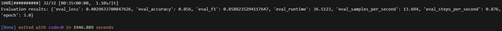

# Hugging Face BERT Fine-Tuning Project

This project fine-tunes a pre-trained [BERT](https://huggingface.co/bert-base-uncased) (Bidirectional Encoder Representations from Transformers) model using the Hugging Face Transformers library for a natural language processing (NLP) task. Specifically, this project focuses on **sentiment analysis** using the IMDb dataset, which contains 50,000 movie reviews labeled as either positive or negative.

---

## Objective

- Fine-tune a BERT model (e.g., `bert-base-uncased`) on a public NLP dataset (IMDb).
- Debug and optimize training and evaluation steps using Hugging Face's tools.
- Evaluate model performance using structured metrics like **accuracy** and **F1-score**.

---

### Part 1: Fine-Tuning BERT
- **Task**: Sentiment Analysis on IMDb reviews.
- **Steps**:
  - Load the IMDb dataset.
  - Preprocess the data using `BertTokenizer`.
  - Fine-tune [`bert-base-uncased`](https://huggingface.co/bert-base-uncased) with Hugging Face's `Trainer` API.
  - Use a subset (2,000 training / 500 test) for quicker experimentation.

### Part 2: Debugging Issues
- **Initial Challenges**:
  - Overfitting on smaller dataset size.
  - Very long training time on IMDb data.
- **Resolutions**:
  - Reduced dataset size.
  - Tuned batch size and learning rate.
  - Used weight decay and logging to stabilize training.

### Part 3: Evaluating the Model
- **Metrics Used**:
  - Accuracy
  - F1 Score

- **Script Output**:
  - Evaluation results:  
    `{'eval_loss': 0.402963700847626, 'eval_accuracy': 0.856, 'eval_f1': 0.8588325294117647, 'eval_runtime': 36.5123, 'eval_samples_per_second': 13.694, 'eval_steps_per_second': 0.876, 'epoch': 3.0}`
  - The model correctly predicted sentiment in **85.6%** of test samples.
  - F1 score of **0.8588** shows strong balance between precision and recall.
  - Evaluation completed in **36.5 seconds**, processing ~13.7 samples/sec.
  - See training logs and final metrics visualized below.

#### Training Logs  
Shows training output from the Hugging Face `Trainer`, capturing metrics during the fine-tuning process.

Each line in the log represents a **training step**, and includes:

- **Step 10/375** – Indicates current batch out of total (375 steps per epoch × 3 epochs).
- **Elapsed Time** – Shows how long training has been running.
- **Steps/sec (it)** – Iteration speed (e.g. 5.05s/it).
- **loss** – Current training loss; a lower value indicates improved model performance.
- **grad_norm** – Norm of gradients; helps identify instability or vanishing gradients.
- **learning_rate** – Dynamically adjusted to optimize training.
- **epoch** – Fractional progress through the current epoch.

These logs help monitor model learning, detect instability, and track convergence over time.


#### Model Evaluation  
This output is printed at the end of training and shows how the model performed on the test dataset after 3 full epochs.

Key metrics & what they mean:

- **eval_loss**: `0.4029` – Lower values mean better performance; this shows the model made fewer mistakes on test data.
- **eval_accuracy**: `0.856` – The model correctly predicted 85.6% of the IMDb test reviews.
- **eval_f1**: `0.8588` – The F1 score balances precision and recall, especially helpful when classes are imbalanced.
- **eval_runtime**: `36.5s` – Time taken to evaluate the model on the full test set.
- **eval_samples_per_second**: `13.694` – Evaluation speed, helpful for benchmarking.
- **eval_steps_per_second**: `0.876` – Reflects how fast evaluation steps were processed.
- **epoch**: `3.0` – Confirms evaluation was performed after the final (3rd) training epoch.

These results show that the BERT model generalized well to unseen data.


  
### Part 4: What's Next?
This model can be extended to:

- Classify Google or Amazon reviews.
- Filter out toxic social media comments.
- Build a review assistant tool.
- Try techniques like early stopping, mixed precision training (`fp16`), or experimenting with other models like `distilbert-base-uncased`.

---

## Tools & Frameworks

- **Model**: Bidirectional Encoder Representations from Transformers (BERT)
- **Libraries**: Hugging Face `transformers`, `datasets`, `evaluate`
- **Language**: Python 3
- **Framework**: PyTorch
- **Training Interface**: Hugging Face `Trainer` API

---

## Sentiment Analysis with IMDb

The [IMDb dataset](https://huggingface.co/datasets/imdb) contains 25,000 training and 25,000 test movie reviews labeled as either positive or negative.

Steps:
- Tokenize text using BERT tokenizer (`bert-base-uncased`)
- Fine-tune BERT for binary classification
- Subset used for faster iteration:
- 2,000 training samples
- 500 test samples

---

## Project Structure

huggingface-bert-finetune/
├── hf_bert_imdb.py       # Training and evaluation script
├── requirements.txt      # Python dependencies
├── README.md             # Project documentation
├── .gitignore
├── results/              # Output for logs and checkpoints
└── images/               # Screenshots
    ├── running.png       # Training logs screenshot
    └── results.png       # Evaluation output screenshot

---

## Features

- Tokenization with Hugging Face Tokenizer
- Dataset loading with `datasets`
- Model fine-tuning using `Trainer` API
- Accuracy & F1-Score metrics with `evaluate`
- Evaluation results printout

---

## How to Run

1. Clone the repo and install requirements:
```bash
git clone https://github.com/ashworth3/bert-huggingface-nlp.git
cd bert-huggingface-nlp
python -m venv env
source env/bin/activate  # or `env\Scripts\activate` Windows
pip install -r requirements.txt
```

2. Run script:
```bash
python hf_bert_imdb.py
```

3. Watch training progress and check final evaluation at the end.

---

By [@ashworth3](https://github.com/ashworth3)